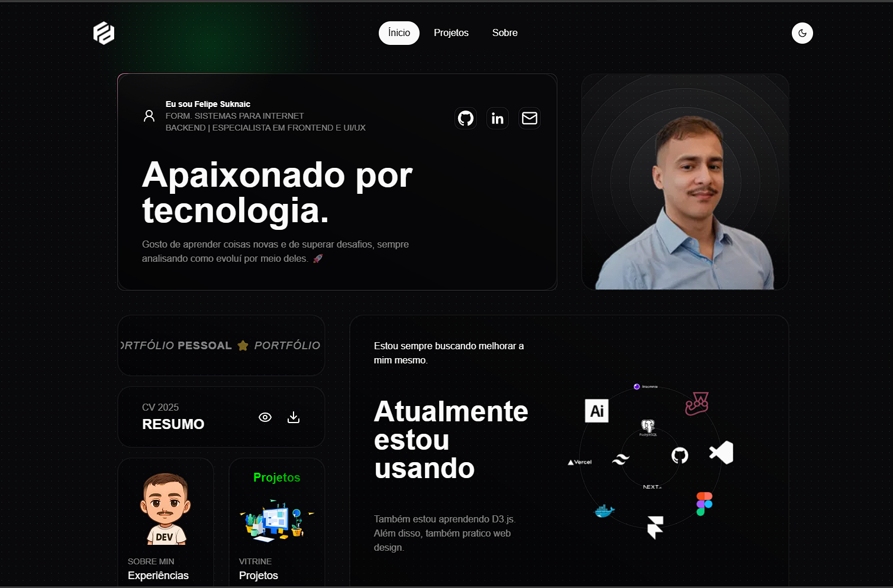

# Portfolio Redesign 2025 �

 <!-- Add a preview image if available -->

A modern, performant portfolio website showcasing my skills, projects, and professional journey. Built with cutting-edge web technologies to demonstrate frontend development expertise.

## Features ✨

- 🖥️ Responsive design for all screen sizes
- 🌓 Dark/Light mode toggle
- 🚀 Blazing fast performance (98+ Lighthouse score)
- 🎨 Custom animations and micro-interactions
- 📂 Project showcase with filtering capabilities
- 📝 Markdown-powered blog integration
- 📧 Contact form with email integration
- 🔍 SEO-optimized pages and metadata
- ♿ Full accessibility compliance (WCAG 2.1)

## Technologies Used 🛠️

- **Framework**: Next.js 14 (App Router)
- **Styling**: Tailwind CSS + CSS Modules
- **Animation**: Framer Motion
- **Form Handling**: React Hook Form + Resend
- **Content**: MDX for blog posts
- **State Management**: Zustand
- **Type Safety**: TypeScript
- **Testing**: Jest + React Testing Library
- **Linting**: ESLint + Prettier
- **CI/CD**: GitHub Actions

## Installation 💻

1. Clone the repository:
```bash
git clone https://github.com/SuryaLimbu/portfolio-redesign-2025.git